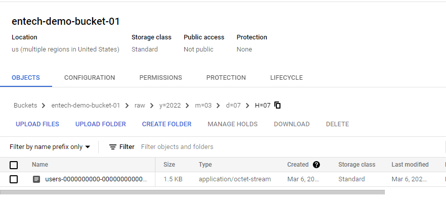

- [Kafka connect GCS(Google Cloud Storage)](#kafka-connect-gcsgoogle-cloud-storage)
  - [Instructions](#instructions)
  - [Output](#output)
  - [References](#references)
  
# Kafka connect GCS(Google Cloud Storage)

## Instructions
- Start the containers by running `docker-compose up --remove-orphans -d --build`
- Navigate to control center in `http://<your-host-name>:9021/clusters`
- Clean the demo resources by running `docker-compose down -v --remove-orphans`

## Output

## References
- https://github.com/aiven/gcs-connector-for-apache-kafka/releases/tag/v0.9.0
- https://help.aiven.io/en/articles/2888122-aiven-for-apache-kafka-gcs-sink-connector-by-aiven
- https://docs.aviatrix.com/HowTos/CreateGCloudAccount.html